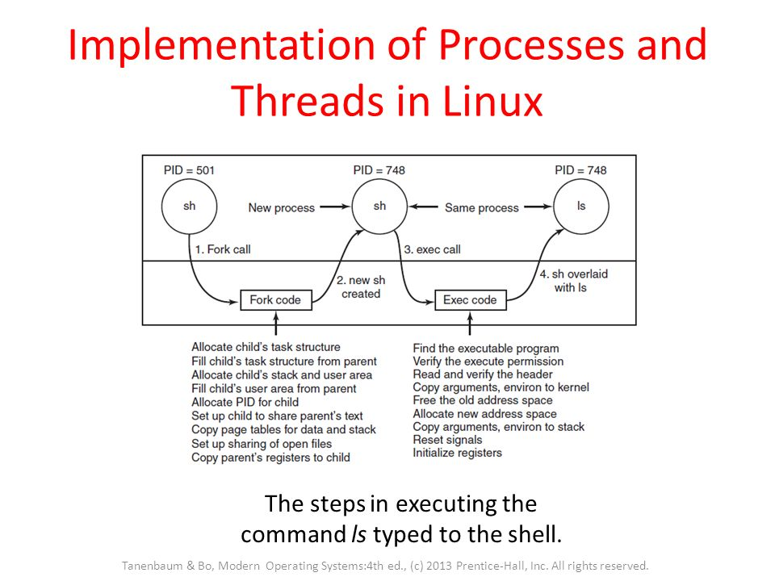

# Linux Kernel subsystems

a) IO component
b) Memory management Component
c) Process management Component

IO Component : All linux drivers are classified into two types character device drivers or block device drivers, , the main difference being that seeks and random accesses are allowed on block devices and not on character devices

// Insert diagram here

Memory Management Component: This is responsible for efficient virtual to physical memory mapping, page replacement policy and even storing 

Process Management Component: The key responsibility of the process-management component is the creation and termination of processes. It also includes the process scheduler, which chooses which process or, rather, thread to run next. As we shall see in the next section, the Linux kernel treats both processes and threads simply as executable entities, andwill schedule them based on a global scheduling policy. Finally, code for signal handling also belongs to this component.


## Process management in linux

Each process has a program counter keeping track of the next instruction to be executed. As linux is a multiprogramming kernel it runs thousands of processes.

To create a process linux uses the `fork` command where it creates a new process identical to the one it is running. The one that calls fork is called as the parent process and the one that is created is called the child process. The parent gets assigned the PID of the child and the child gets returned a PID of 0. This is how the processes identify which one is which

**Communication** : Processes can communicate using pipes.These are channels between processes that can be used to read and write data. Reading data is a blocking operation in that it waits for data to be inserted into the pipe 

```
sort <f | head
```

Hear both sort and head are two processes where the output of sort is fed to the standard input of head

Processes also communicate with each other using signals. Signals can either be caught, ignored or acted upon. Usually signals are used to kill processes. 

// insert systems calls here


## How does the kernel keep track of the processes running

The kernel uses `task_struct` which is a process descriptor to get information about processes. The ways to obtain information about `task_struct` is as follows: 

```
read_lock(&tasklist_lock);

# Method One
p = find_task_by_vpid(pid); 

# Method Two
for_each_process(p) {
    // p is a pointer to a task_struct instance.
}

read_unlock(&tasklist_lock);
}

// Later, once you're finished with the task, execute:
put_task_struct(p);
```

Here the read_lock is just to make sure that none of the threads/processes disappear while we are reading it.
All the task_structures are stored in doubly linked list that can be easily iterated, furthemore they are mapped via the pid for quick acess.

### Now let us see how a process is created in linux

<p align="center">
  
</p>

1) A new process descriptor and user area are created for the process and all the information is mostly filled in from the parent.

2) Linux then looks for an available PID and then assigns the PID to this child process. It sets up the child to share the parents text(Allocating memory is expensive so the Linux cheats here by just making a copy of the parents text and giving it read permissionWhenever either process (the child or the parent) tries to write on a page, it gets a protection fault. The kernel sees this and then allocates a new copy of the page to the faulting process and marks it read/write. In this way, only pages that are actually written have to be copied. This mechanism is called copy on write. It has the additional benefit of not requiring two copies of the program in memory, thus saving RAM.s)

3) Setup sharing of open files(ie descriptors)

4) Copy parents register to child

5) Once this is done the child process calls exec which finds the binary to run 

6) It then copies the env to kernel resets signals and initializes registers.


## Understanding how threads are created

Before we start we need to know the difference between a process and a thread. A process is the execution of a program and it can use a thread to make calls to the system. 

There are two types of threads 

 1) User level thread

 2) Kernel level thread 

When executing a system call the process thread moves into the kernel mode where it gets full access to system resources and different memory maps. It is still the same thread, but now with more power and also its own kernel mode stack and kernel mode program counter. 

So bascially threads can either have a totally new address space or share the same address space. If they share the same space they are effectively getting created in the same process. So anything they write can be read by all processes. However if they are running in a new address space the things they write do not get read by all other processes.

All threads in the same process will get the same PID.


## Understanding basics of linux kernel by writing a shell in C

We just need to understand for the basis of this tutorial what a shell does:

a) Reads input from stdin

b) Splits it up into arguments

c) Exectues the arguments and then exits


## Init Process
Basicall init process is the parent of all processes inside linux. It boots up all the other processes inside linux. Its principle role is to create processes from a script stored in the file `/etc/inittab`. Based on the run levels defined in this file init takes the necessary decisions. It is the last command execute in the linux kernel boot sequence.


## How a shell starts up a process in linux

For this we need to learn a bit about how processes work in linux. So if the program is not init the only way to start a process is by forking it. So a fork creates a duplicate process. The process that called it becomes the parent and the process that gets forked becomes the child process. The parent returns a 0 to the child and a 1 gets returned to the parent. However we do not need an exact copy of the process we need an entirely new process. For this the child process calls `execv` to start an entirely new process. The parent process can keep tabs on its child using the `wait` command.

Let us look at this piece of code and understand it a bit more deeply 


```
int lsh_launch(char **args)
{
  pid_t pid, wpid;
  int status;

  pid = fork();
  if (pid == 0) {
    // Child process
    if (execvp(args[0], args) == -1) {
      perror("lsh");
    }
    exit(EXIT_FAILURE);
  } else if (pid < 0) {
    // Error forking
    perror("lsh");
  } else {
    // Parent process
    do {
      wpid = waitpid(pid, &status, WUNTRACED);
    } while (!WIFEXITED(status) && !WIFSIGNALED(status));
  }

  return 1;
}
```

In the child process, we want to run the command given by the user. So, we use one of the many variants of the exec system call, execvp. The different variants of exec do slightly different things. Some take a variable number of string arguments. Others take a list of strings. Still others let you specify the environment that the process runs with. This particular variant expects a program name and an array (also called a vector, hence the ‘v’) of string arguments (the first one has to be the program name). The ‘p’ means that instead of providing the full file path of the program to run, we’re going to give its name, and let the operating system search for the program in the path.

The third condition means that `fork()` executed successfully. The parent process will land here. We know that the child is going to execute the process, so the parent needs to wait for the command to finish running. We use waitpid() to wait for the process’s state to change. Unfortunately, waitpid() has a lot of options (like exec()). Processes can change state in lots of ways, and not all of them mean that the process has ended. A process can either exit (normally, or with an error code), or it can be killed by a signal. So, we use the macros provided with waitpid() to wait until either the processes are exited or killed. Then, the function finally returns a 1, as a signal to the calling function that we should prompt for input again.

## File descriptors

Let us learn a bit about file descriptors and how linux handles file descriptors. A file descriptor is generally an integer and it is used by linux to denote an open file. 
Every process in linux has a file descriptor table which stores the file descriptors that the process has opened. You also have a system wide open file descriptor table.

`open`: The open syscall returns the lowest file descriptor not currently used for that process. 
`dup`: The dup syscall is used to duplicate a file descriptor, it is used when you want to redirect output say for example you want to redirect output from stdout to a file, you can duplicate that file descriptor and then assign it to stdout.


Most linux kernels define seven types of files.
1) Regular files
2) Directories
3) Character device files
4) Block device files
5) Local domain sockets
6) Named pipes (FIFOs) and
7) Symbolic links

`read` function call:
 the read function reads data from a file descriptor into a buffer. It returns the number of bytes read, which may be less than the requested amount. A return value of 0 indicates the end of the file, while -1 signifies an error. Short reads are possible, and the handling of errors and end-of-file conditions depends on the specific situation and the nature of the input source.

### Inodes

Inodes are datastructures inside linux that are used to store information about files. They generally store information like the following:

  * Size
  * Permission
  * Owner/Group
  * Location of the hard drive
  * Date/time
  * Other information

When a new file is created it is assigned an inode number and a file name and this inode number is unique within that file system.
There is an inode table to store all of this information

#### Symlinks (Soft and Hard links)

Hard links is an additional name or reference pointing to the same inode. Any change made to either of the files will reflect in all the other hard links because they point to the same inode. 

Soft links are shortcuts, they bascially point to the orginal file. Soft link creation involves the creation of a new inode that contains the path to the original file. It does not directly point to the inode of the original file. It gets treated as a special file with the path to the original as a reference.