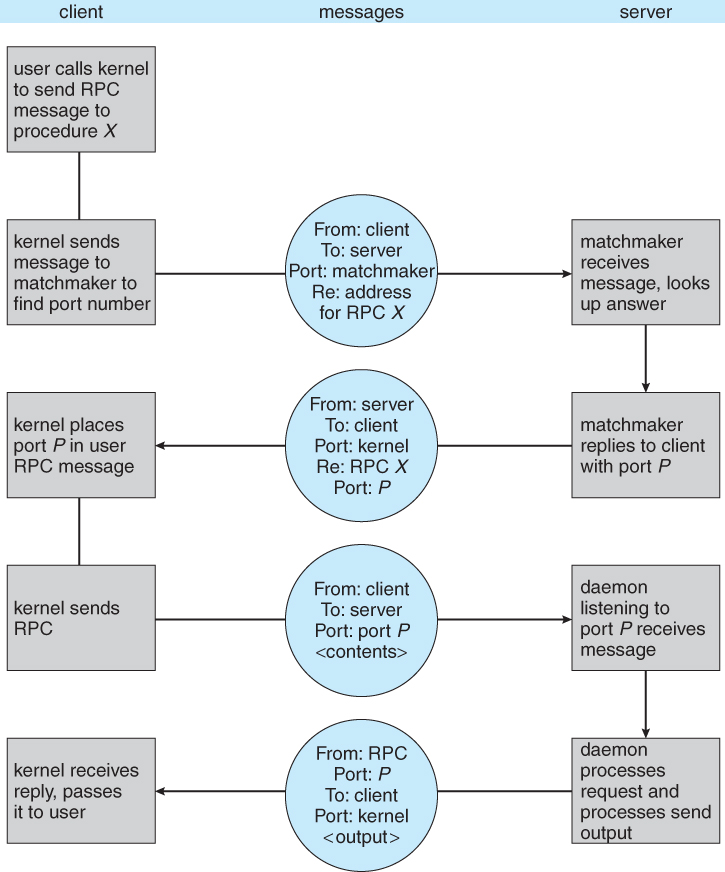

# Linux Kernel subsystems

a) IO component
b) Memory management Component
c) Process management Component

IO Component : All linux drivers are classified into two types character device drivers or block device drivers, , the main difference being that seeks and random accesses are allowed on block devices and not on character devices

// Insert diagram here

Memory Management Component: This is responsible for efficient virtual to physical memory mapping, page replacement policy and even storing 

Process Management Component: The key responsibility of the process-management component is the creation and termination of processes. It also includes the process scheduler, which chooses which process or, rather, thread to run next. As we shall see in the next section, the Linux kernel treats both processes and threads simply as executable entities, andwill schedule them based on a global scheduling policy. Finally, code for signal handling also belongs to this component.


## Process management in linux

Each process has a program counter keeping track of the next instruction to be executed. As linux is a multiprogramming kernel it runs thousands of processes.

To create a process linux uses the `fork` command where it creates a new process identical to the one it is running. The one that calls fork is called as the parent process and the one that is created is called the child process. The parent gets assigned the PID of the child and the child gets returned a PID of 0. This is how the processes identify which one is which

Process memory is divided into four sections as shown

<p align="center">
  
</p>


1) The text section comprises the compiled program code, read in from non-volatile storage when the program is launched.
2) The data section stores global and static variables, allocated and initialized prior to executing main.
3) The heap is used for dynamic memory allocation, and is managed via calls to new, delete, malloc, free, etc.
4) The stack is used for local variables. Space on the stack is reserved for local variables when they are declared ( at function entrance or elsewhere, depending on the language ), and the space is freed up when the variables go out of scope. Note that the stack is also used for function return values, and the exact mechanisms of stack management may be language specific.
5) Note that the stack and the heap start at opposite ends of the process's free space and grow towards each other. If they should ever meet, then either a stack overflow error will occur, or else a call to new or malloc will fail due to insufficient memory available.

**Process Represenation**

**Context Switching**
Context switching is the process of saving and restoring the state of a process or thread so that multiple processes or threads can share a single CPU. It involves storing the current execution context (e.g., CPU registers, program counter, stack pointer) of a running process, loading the saved context of another process, and transferring control to it. Context switching allows for multitasking and efficient CPU utilization in a multi-process or multi-threaded environment.


**Communication** : Processes can communicate using pipes.These are channels between processes that can be used to read and write data. Reading data is a blocking operation in that it waits for data to be inserted into the pipe 


## Inter process communication

**Shared Memory**: Shared memory is an inter-process communication (IPC) mechanism where multiple processes can share a common region of memory. It allows processes to exchange data without the need for copying or transferring the data between them. Instead, they directly access the shared memory region, improving efficiency and reducing overhead. Processes can read from and write to shared memory, enabling fast and efficient communication and synchronization between cooperating processes.

**Remote Procedure Call**: 

This image describes remote procedure calls. It is pretty self explanatory

<p align="center">
  
</p>


**Pipes**

Pipes are another method of communication between processes in linux. Let us look at how pipes work in linux

In UNIX ordinary pipes are created with the system call "int pipe( int fd [ ] )".
The return value is 0 on success, -1 if an error occurs.
The int array must be allocated before the call, and the values are filled in by the pipe system call:
`fd[ 0 ]` is filled in with a file descriptor for the reading end of the pipe
`fd[ 1 ]` is filled in with a file descriptor for the writing end of the pipe
UNIX pipes are accessible as files, using standard read( ) and write( ) system calls.
Ordinary pipes are only accessible within the process that created them.
Typically a parent creates the pipe before forking off a child.
When the child inherits open files from its parent, including the pipe file(s), a channel of communication is established.
Each process ( parent and child ) should first close the ends of the pipe that they are not using. For example, if the parent is writing to the pipe and the child is reading, then the parent should close the reading end of its pipe after the fork and the child should close the writing end.

**Signals**
Signals are another way of interprocess communication. Let us see some of the most common signals.

SIGINT (2): The interrupt signal, typically generated by pressing Ctrl+C. It is used to request the termination of a process.
SIGKILL (9): The kill signal, which causes immediate termination of a process. It cannot be caught or ignored.
SIGTERM (15): The termination signal, similar to SIGKILL, but can be caught or ignored. It allows the process to perform cleanup operations before termination.
SIGSTOP (19) and SIGCONT (18): The stop and continue signals, respectively. SIGSTOP suspends a process, while SIGCONT resumes its execution.
SIGCHLD (17): The child status change signal, sent to the parent process when a child process terminates or stops. This is important because the parent needs to do all the necessary cleanup. so that there are no zombie processes created. 


## How does the kernel keep track of the processes running

The kernel uses `task_struct` which is a process descriptor to get information about processes. The ways to obtain information about `task_struct` is as follows: 

```
read_lock(&tasklist_lock);

# Method One
p = find_task_by_vpid(pid); 

# Method Two
for_each_process(p) {
    // p is a pointer to a task_struct instance.
}

read_unlock(&tasklist_lock);
}

// Later, once you're finished with the task, execute:
put_task_struct(p);
```

Here the read_lock is just to make sure that none of the threads/processes disappear while we are reading it.
All the task_structures are stored in doubly linked list that can be easily iterated, furthemore they are mapped via the pid for quick acess.

### Now let us see how a process is created in linux

<p align="center">
  
</p>

1) A new process descriptor and user area are created for the process and all the information is mostly filled in from the parent.

2) Linux then looks for an available PID and then assigns the PID to this child process. It sets up the child to share the parents text(Allocating memory is expensive so the Linux cheats here by just making a copy of the parents text and giving it read permissionWhenever either process (the child or the parent) tries to write on a page, it gets a protection fault. The kernel sees this and then allocates a new copy of the page to the faulting process and marks it read/write. In this way, only pages that are actually written have to be copied. This mechanism is called copy on write. It has the additional benefit of not requiring two copies of the program in memory, thus saving RAM.s)

3) Setup sharing of open files(ie descriptors)

4) Copy parents register to child

5) Once this is done the child process calls exec which finds the binary to run 

6) It then copies the env to kernel resets signals and initializes registers.


## Understanding how threads are created

Before we start we need to know the difference between a process and a thread. A process is the execution of a program and it can use a thread to make calls to the system. 

There are two types of threads 

 1) User level thread

 2) Kernel level thread 

When executing a system call the process thread moves into the kernel mode where it gets full access to system resources and different memory maps. It is still the same thread, but now with more power and also its own kernel mode stack and kernel mode program counter. 

So bascially threads can either have a totally new address space or share the same address space. If they share the same space they are effectively getting created in the same process. So anything they write can be read by all processes. However if they are running in a new address space the things they write do not get read by all other processes.

All threads in the same process will get the same PID.


## Understanding basics of linux kernel by writing a shell in C

We just need to understand for the basis of this tutorial what a shell does:

a) Reads input from stdin

b) Splits it up into arguments

c) Exectues the arguments and then exits


## Init Process
Basicall init process is the parent of all processes inside linux. It boots up all the other processes inside linux. Its principle role is to create processes from a script stored in the file `/etc/inittab`. Based on the run levels defined in this file init takes the necessary decisions. It is the last command execute in the linux kernel boot sequence.


## How a shell starts up a process in linux

For this we need to learn a bit about how processes work in linux. So if the program is not init the only way to start a process is by forking it. So a fork creates a duplicate process. The process that called it becomes the parent and the process that gets forked becomes the child process. The parent returns a 0 to the child and a 1 gets returned to the parent. However we do not need an exact copy of the process we need an entirely new process. For this the child process calls `execv` to start an entirely new process. The parent process can keep tabs on its child using the `wait` command.

Let us look at this piece of code and understand it a bit more deeply 


```
int lsh_launch(char **args)
{
  pid_t pid, wpid;
  int status;

  pid = fork();
  if (pid == 0) {
    // Child process
    if (execvp(args[0], args) == -1) {
      perror("lsh");
    }
    exit(EXIT_FAILURE);
  } else if (pid < 0) {
    // Error forking
    perror("lsh");
  } else {
    // Parent process
    do {
      wpid = waitpid(pid, &status, WUNTRACED);
    } while (!WIFEXITED(status) && !WIFSIGNALED(status));
  }

  return 1;
}
```

In the child process, we want to run the command given by the user. So, we use one of the many variants of the exec system call, execvp. The different variants of exec do slightly different things. Some take a variable number of string arguments. Others take a list of strings. Still others let you specify the environment that the process runs with. This particular variant expects a program name and an array (also called a vector, hence the ‘v’) of string arguments (the first one has to be the program name). The ‘p’ means that instead of providing the full file path of the program to run, we’re going to give its name, and let the operating system search for the program in the path.

The third condition means that `fork()` executed successfully. The parent process will land here. We know that the child is going to execute the process, so the parent needs to wait for the command to finish running. We use waitpid() to wait for the process’s state to change. Unfortunately, waitpid() has a lot of options (like exec()). Processes can change state in lots of ways, and not all of them mean that the process has ended. A process can either exit (normally, or with an error code), or it can be killed by a signal. So, we use the macros provided with waitpid() to wait until either the processes are exited or killed. Then, the function finally returns a 1, as a signal to the calling function that we should prompt for input again.

## File System
Let us learn a bit about file descriptors and how linux handles file descriptors. A file descriptor is generally an integer and it is used by linux to denote an open file. 
Every process in linux has a file descriptor table which stores the file descriptors that the process has opened. You also have a system wide open file descriptor table.

`open`: The open syscall returns the lowest file descriptor not currently used for that process. 
`dup`: The dup syscall is used to duplicate a file descriptor, it is used when you want to redirect output say for example you want to redirect output from stdout to a file, you can duplicate that file descriptor and then assign it to stdout.


Most linux kernels define seven types of files.
1) Regular files
2) Directories
3) Character device files
4) Block device files
5) Local domain sockets
6) Named pipes (FIFOs) and
7) Symbolic links

`read` function call:
 the read function reads data from a file descriptor into a buffer. It returns the number of bytes read, which may be less than the requested amount. A return value of 0 indicates the end of the file, while -1 signifies an error. Short reads are possible, and the handling of errors and end-of-file conditions depends on the specific situation and the nature of the input source.

 ### How are files created
 When a new file is created, a new FCB is allocated and filled out with important information regarding the new file. The appropriate directory is modified with the new file name and FCB information.
When a file is accessed during a program, the open( ) system call reads in the FCB information from disk, and stores it in the system-wide open file table. An entry is added to the per-process open file table referencing the system-wide table, and an index into the per-process table is returned by the open( ) system call. UNIX refers to this index as a file descriptor, and Windows refers to it as a file handle.
If another process already has a file open when a new request comes in for the same file, and it is sharable, then a counter in the system-wide table is incremented and the per-process table is adjusted to point to the existing entry in the system-wide table.
When a file is closed, the per-process table entry is freed, and the counter in the system-wide table is decremented. If that counter reaches zero, then the system wide table is also freed. Any data currently stored in memory cache for this file is written out to disk if necessary.

### Inodes

Inodes are datastructures inside linux that are used to store information about files. They generally store information like the following:

  * Size
  * Permission
  * Owner/Group
  * Location of the hard drive
  * Date/time
  * Other information

When a new file is created it is assigned an inode number and a file name and this inode number is unique within that file system.
There is an inode table to store all of this information

### Symlinks (Soft and Hard links)

Hard links is an additional name or reference pointing to the same inode. Any change made to either of the files will reflect in all the other hard links because they point to the same inode. 

Soft links are shortcuts, they bascially point to the orginal file. Soft link creation involves the creation of a new inode that contains the path to the original file. It does not directly point to the inode of the original file. It gets treated as a special file with the path to the original as a reference.


### Allocation Methods

**Contiguous Allocation** : 
  * In contigous allocation files are allocated sequentially.
  * Reading is easy beacuase disk head does not have to move much
  * Problems can arise when files grow, or if the exact size of a file is unknown at creation time:
      Over-estimation of the file's final size increases external fragmentation and wastes disk space.
      Under-estimation may require that a file be moved or a process aborted if the file grows beyond its originally allocated space.
      If a file grows slowly over a long time period and the total final space must be allocated initially, then a lot of space becomes unusable before the file fills the space.

**Linked List Allocation** : As you can tell files are allocated linked to each other
  * Harder to access because we need to traverse the entire linked list to find a particular file
  * DLL provide some protection but again it is a wastage of space.

**Indexed Allocation**: In indexed allocation, a separate block called the "index block" or "index node" is used to store the addresses or pointers to the actual data blocks that comprise a file.


## Virtual Filesystem

Components of a Virtual File System:

VFS Interface: The VFS interface defines a standardized set of system calls and data structures that applications can use to interact with the file system. Examples of common system calls include open(), read(), write(), mkdir(), stat(), and unlink(). The VFS interface shields applications from the details of the underlying file systems.
vir
VFS Layer: The VFS layer acts as an intermediary between the VFS interface and the actual file system implementations. It receives the system calls from the applications and routes them to the appropriate file system driver based on the file system type or mount point. The VFS layer handles tasks such as path resolution, permission checks, and maintaining file descriptors.

File System Drivers: File system drivers are responsible for implementing the specific operations required by a particular file system. Each file system (e.g., ext4, NTFS, FAT32) has its own driver that understands the file system's on-disk structure, metadata, and algorithms. The file system driver translates the generic VFS operations into file system-specific operations to perform the requested tasks.


## Linux File System Layers

- **User Applications:** e.g., ls, cat, echo, more, touch
  - ↓
- **System Call Interface:** Functions such as open(), read(), write(), close(), etc.
  - ↓
- **Virtual File System (VFS):** Provides a uniform API for different FS types, handles inode and dentry
  - ↓
- **File System-specific Implementation:** e.g., ext4, xfs, NTFS, Btrfs, procfs, nfs, etc.
  - ↓
- **Block Device Interface:** Handles communication between the file system and the hardware, disk scheduling
  - ↓
- **Hardware:** Disk drives, SSD, etc.

The arrows indicate the flow of a call from a user application down to the hardware.
