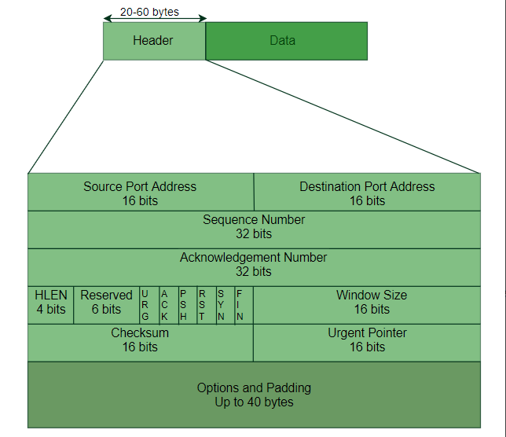
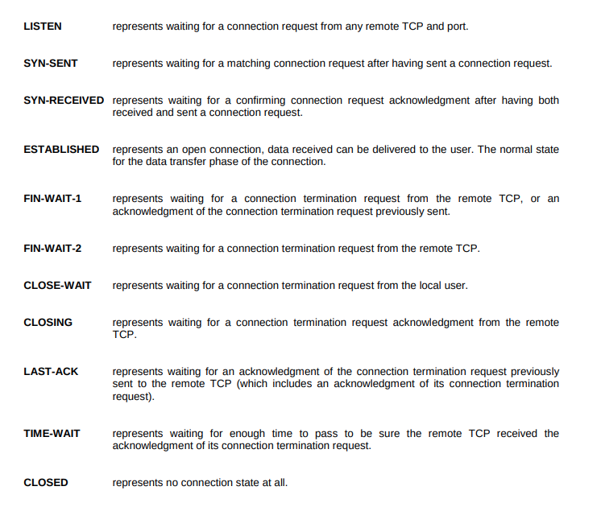

# Networking

There are two major models in networking namely
a) OSI Model
b) TCP/IP 5 layer model

  

### Terms that can be used in the future

Single collison domain: A domain in which network devices cannot transmit at the same time without causing a collison.

### Ethernet and MAC Layer

**CSMA/CD** : Carrier sense multiple access detects the channel for collision and if detected resends the message.

**MAC Address**: A globally unique identifier attached to an individual network interface.

It is a 48 bit number and the possibilities are 2^48 and that means it is possible to have globally unique identifiers for the mac addresses.

Now the mac address is split into 6 octets as shown below

  

The last three octets is upto the manufacturer.

### Unicast Multicast and broadcast

Unicast: In unicast there is only one receiver.

Broadcast: In broadcast the message is sent to all devices. This is accomplished by using a broadcast address. FF:FF:FF:FF:FF

Let us take a look at the ethernet frame

  

# Network Layer

### IP Addresses

It is a 32 bit number. These are described in 4 octets, and therefore can represent 0 to 255 numbers. This is known as dotted decimal notation

There are two types of addresses:

a) Dynamic IP Addresses

b) Static IP Addresses

  

Version: Version number like IPV4

Header len: 20 bytes

Type of service : Quality of service details etc

Total Length field : This indicates the length of the datagram. It is 16bits

Flags: States whether the datagram is fragmented and the fragment offset is 

TTL : States how many hops the datagram will live before it dies out

upper layer: It defines the transport layer protocol to be used, the most common ones are TCP and UDP.

An IP address is split up into a network id and a host ID.

### Subnetting 

The IP Address space is divided into three major classes

Class A : NetworkID: 8 bits
Class B : NetworkID: 16 bits
Class C : NetworkID: 24 bits

Because an IP address is limited to indicating the network and the device address, IP addresses cannot be used to indicate which subnet an IP packet should go to. Routers within a network use something called a `subnet mask` to sort data into subnetworks.

For a real-world example, suppose an IP packet is addressed to the IP address 192.0.2.15. This IP address is a Class C network, so the network is identified by "192.0.2" (or to be technically precise, 192.0.2.0/24). Network routers forward the packet to a host on the network indicated by "192.0.2."

Once the packet arrives at that network, a router within the network consults its routing table. It does some binary mathematics using its subnet mask of 255.255.255.0, sees the device address "15" (the rest of the IP address indicates the network), and calculates which subnet the packet should go to. It forwards the packet to the router or switch responsible for delivering packets within that subnet, and the packet arrives at IP address 192.0.2.15 (learn more about routers and switches).

  

### CIDR

  

### VLAN

In essence, a VLAN is a collection of devices or network nodes that communicate with one another as if they made up a single LAN, when in reality they exist in one or several LAN segments. In a technical sense, a segment is separated from the rest of the LAN by a bridge, router, or switch, and is typically used for a particular department. This means that when a workstation broadcasts packets, they reach all other workstations on the VLAN but none outside it.

### DNS

DNS Servers resolve hostnames into IP addresses. There are 4 types of dns servers

a) DNS Recursor --> It is responsible for hunting down the IP address for the hostname. It searches for the authoritative nameserver and returns back the IP address. It caches the search results.

b) Root Nameserver
c) TLD Nameserver
d) Authoritative Nameserver --> It is the last in the foodchain of the dns lookups and will return the value for the hostname

The 8 steps in a DNS lookup:
* A user types ‘example.com’ into a web browser and the query travels into the Internet and is received by a DNS recursive resolver.
* The resolver then queries a DNS root nameserver (.).
* The root server then responds to the resolver with the address of a Top Level Domain (TLD) DNS server (such as .com or .net), which stores the information for its domains. When searching for example.com, our request is pointed toward the .com TLD.
* The resolver then makes a request to the .com TLD.
* The TLD server then responds with the IP address of the domain’s nameserver, example.com.
* Lastly, the recursive resolver sends a query to the domain’s nameserver.
* The IP address for example.com is then returned to the resolver from the nameserver.
* The DNS resolver then responds to the web browser with the IP address of the domain requested initially.
* Once the 8 steps of the DNS lookup have returned the IP address for example.com, the browser is able to make the request for the web page:

**3 types of DNS queries:**

* Recursive query - In a recursive query, a DNS client requires that a DNS server (typically a DNS recursive resolver) will respond to the client with either the requested resource record or an error message if the resolver can't find the record.
* Iterative query - in this situation the DNS client will allow a DNS server to return the best answer it can. If the queried DNS server does not have a match for the query name, it will return a referral to a DNS server authoritative for a lower level of the domain namespace. The DNS client will then make a query to the referral address. This process continues with additional DNS servers down the query chain until either an error or timeout occurs.
* Non-recursive query - typically this will occur when a DNS resolver client queries a DNS server for a record that it has access to either because it's authoritative for the record or the record exists inside of its cache. Typically, a DNS server will cache DNS records to prevent additional bandwidth consumption and load on upstream servers.

**What are the most common types of DNS record?**
* A record - The record that holds the IP address of a domain. Learn more about the A record.
* AAAA record - The record that contains the IPv6 address for a domain (as opposed to A records, which list the IPv4 address). Learn more about the AAAA record.
* CNAME record - Forwards one domain or subdomain to another domain, does NOT provide an IP address. Learn more about the CNAME record.
* MX record - Directs mail to an email server. Learn more about the MX record.
* TXT record - Lets an admin store text notes in the record. These records are often used for email security. Learn more about the TXT record.

## IP Routing

We have two types of routing protocols

a) Interior Gateway protocols: These protocols are used for routing packets within an autonoums system.

* Distance vector routing: In distance vector routing the individual routers use distances stored in theirs neighbours table to determine how far the destination router might be. It uses the bellman ford algorithm

* Link state routing: In link state routing we store the information for every router and then run algorithms on it to determine the shortest distance to the destination router.

**Routing Information Protocol (RIP)** is a dynamic routing protocol that uses hop count as a routing metric to find the best path between the source and the destination network. It is a distance-vector routing protocol that has an AD value of 120 and works on the application layer of the OSI model. RIP uses port number 520. 

**Open shortest path first (OSPF)** is a link-state routing protocol that is used to find the best path between the source and the destination router using its own shortest path first (SPF) algorithm. A link-state routing protocol is a protocol that uses the concept of triggered updates, i.e., if there is a change observed in the learned routing table then the updates are triggered only, not like the distance-vector routing protocol where the routing table is exchanged at a period of time. 
Open shortest path first (OSPF) is developed by Internet Engineering Task Force (IETF) as one of the Interior Gateway Protocol (IGP), i.e., the protocol which aims at moving the packet within a large autonomous system or routing domain. It is a network layer protocol that works on protocol number 89 and uses AD value 110. OSPF uses multicast address 224.0.0.5 for normal communication and 224.0.0.6 for update to designated router(DR)/Backup Designated Router (BDR). 

b) Exterior Routing Protocols: If you want to route traffic across autonomous systems you would need exterior routing protocols. This is the responsibility of the core routers

**ICMP**
Since IP does not have an inbuilt mechanism for sending error and control messages. It depends on Internet Control Message Protocol(ICMP) to provide an error control. It is used for reporting errors and management queries. It is a supporting protocol and is used by networks devices like routers for sending error messages and operations information., e.g. the requested service is not available or that a host or router could not be reached. 

**Non Routable Address Space**
The IPv4 standard does not support enough IP addresses for every person, i.e., IPv4 addresses are now depleting. To prevent IPv4 exhaustion, in 1996, RFC1918 was published (Request for Comments), it outlined networks that are can be used by anyone within an autonomous system and are known as Non-Routable Address Spaces.

10.0.0.0/8 ( Range: 10.0.0.0 – 10.255.255.255 )

172.16.0.0/12 ( Range: 172.16.0.0 – 172.31.255.255 )

192.168.0.0/16 ( Range: 192.168.0.0 – 192.168.255.255 )

These IP addresses are reserved for private networks, interior gateway protocols will route these address spaces within network. Non-routable address space allows for nodes to communicate with each other on same network. Since every computer need not be connected to every other computer on Internet, non-routable address spaces can be used locally in various private networks.

# Transport Layer

### TCP

TCP stands for transmission control protocol. It is a reliable and stateful way of transmitting data from source port to destination port. 

  

Control flags in a TCP segment

Control flags – 
These are 6 1-bit control bits that control connection establishment, connection termination, connection abortion, flow control, mode of transfer etc. Their function is: 

URG: Urgent pointer is valid

ACK: Acknowledgement number is valid( used in case of cumulative acknowledgement)

PSH: Request for push

RST: Reset the connection

SYN: Synchronize sequence numbers

FIN: Terminate the connection

TCP Socket States

  

Connection oriented protocol: It is a protocol that establishes a connection and uses this to ensure all data has been properly transmitted.

Three way handshake protocol

Step 1 (SYN): In the first step, the client wants to establish a connection with a server, so it sends a segment with SYN(Synchronize Sequence Number) which informs the server that the client is likely to start communication and with what sequence number it starts segments with

Step 2 (SYN + ACK): Server responds to the client request with SYN-ACK signal bits set. Acknowledgement(ACK) signifies the response of the segment it received and SYN signifies with what sequence number it is likely to start the segments with

Step 3 (ACK): In the final part client acknowledges the response of the server and they both establish a reliable connection with which they will start the actual data transfer

### UDP

Though Transmission Control Protocol (TCP) is the dominant transport layer protocol used with most of the Internet services; provides assured delivery, reliability, and much more but all these services cost us additional overhead and latency. Here, UDP comes into the picture. For real-time services like computer gaming, voice or video communication, live conferences; we need UDP. Since high performance is needed, UDP permits packets to be dropped instead of processing delayed packets. There is no error checking in UDP, so it also saves bandwidth. 
User Datagram Protocol (UDP) is more efficient in terms of both latency and bandwidth. 

### Why does DNS use UDP and not TCP

UDP is much faster. TCP is slow as it requires 3 way handshake. The load on DNS servers is also an important factor. DNS servers (since they use UDP) don’t have to keep connections.

DNS requests are generally very small and fit well within UDP segments.

UDP is not reliable, but reliability can be added on application layer. An application can use UDP and can be reliable by using timeout and resend at application layer.

### How can network congestion be caused due to TCP

https://networkengineering.stackexchange.com/questions/49817/what-is-congestion-collapse

### What is an ephemeral port 

n ephemeral port is a communications endpoint (port) of a transport layer protocol of the Internet Protocol Suite that is used for only a short period of time for the duration of a communication session. Such short-lived ports are allocated automatically within a predefined range of port numbers by the IP stack software of a computer operating system. The Transmission Control Protocol (TCP), the User Datagram Protocol (UDP), and the Stream Control Transmission Protocol (SCTP) typically use an ephemeral port for the client-end of a client–server communication. At the server end of the communication session, ephemeral ports may also be used for continuation of communications with a client that initially connected to one of the services listening with a well-known port. For example, the Trivial File Transfer Protocol (TFTP)[1] and Remote Procedure Call (RPC) applications can behave in this manner.