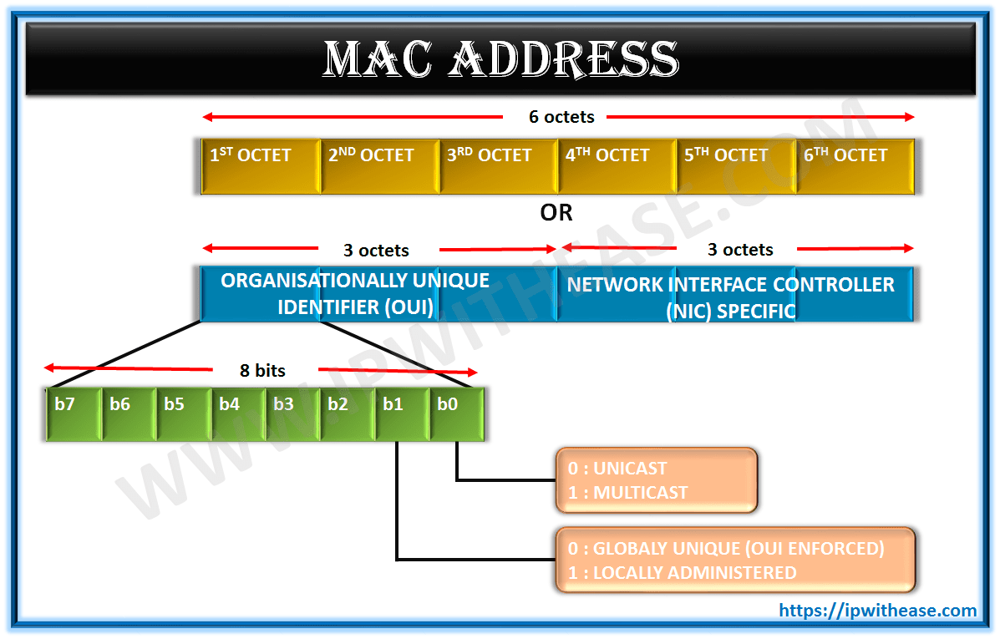
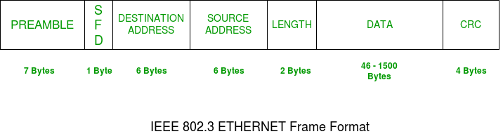
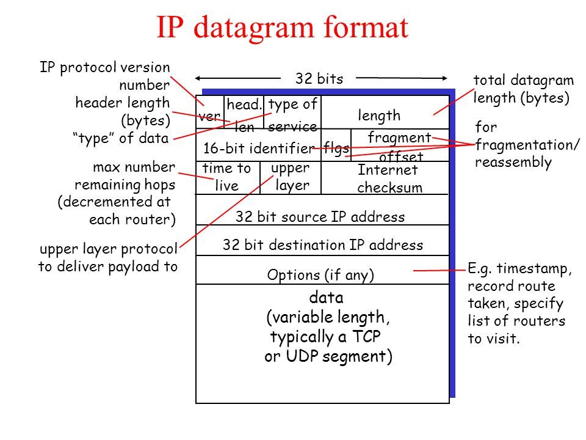
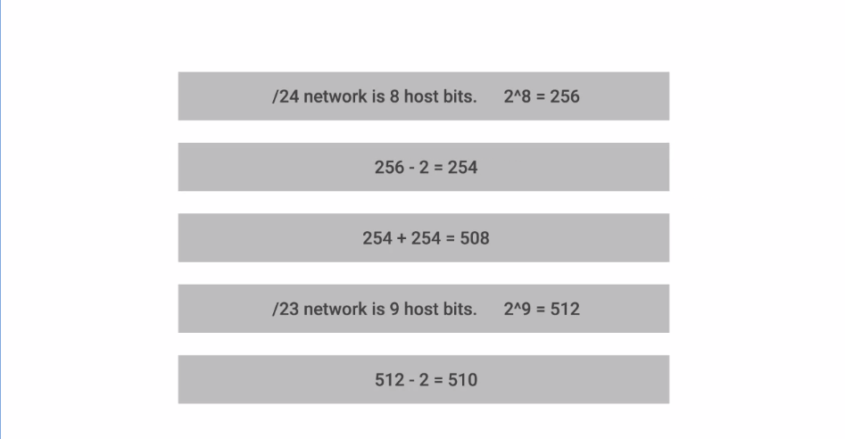

# Networking

There are two major models in networking namely
a) OSI Model
b) TCP/IP 5 layer model

  

### Terms that can be used in the future

Single collison domain: A domain in which network devices cannot transmit at the same time without causing a collison.

### Ethernet and MAC Layer

**CSMA/CD** : Carrier sense multiple access detects the channel for collision and if detected resends the message.

**MAC Address**: A globally unique identifier attached to an individual network interface.

It is a 48 bit number and the possibilities are 2^48 and that means it is possible to have globally unique identifiers for the mac addresses.

Now the mac address is split into 6 octets as shown below

  

The last three octets is upto the manufacturer.

### Unicast Multicast and broadcast

Unicast: In unicast there is only one receiver.

Broadcast: In broadcast the message is sent to all devices. This is accomplished by using a broadcast address. FF:FF:FF:FF:FF

Let us take a look at the ethernet frame

  

# Network Layer

### IP Addresses

It is a 32 bit number. These are described in 4 octets, and therefore can represent 0 to 255 numbers. This is known as dotted decimal notation

There are two types of addresses:

a) Dynamic IP Addresses

b) Static IP Addresses

  

Version: Version number like IPV4

Header len: 20 bytes

Type of service : Quality of service details etc

Total Length field : This indicates the length of the datagram. It is 16bits

Flags: States whether the datagram is fragmented and the fragment offset is 

TTL : States how many hops the datagram will live before it dies out

upper layer: It defines the transport layer protocol to be used, the most common ones are TCP and UDP.

An IP address is split up into a network id and a host ID.

### Subnetting 

The IP Address space is divided into three major classes

Class A : NetworkID: 8 bits
Class B : NetworkID: 16 bits
Class C : NetworkID: 24 bits

Because an IP address is limited to indicating the network and the device address, IP addresses cannot be used to indicate which subnet an IP packet should go to. Routers within a network use something called a `subnet mask` to sort data into subnetworks.

For a real-world example, suppose an IP packet is addressed to the IP address 192.0.2.15. This IP address is a Class C network, so the network is identified by "192.0.2" (or to be technically precise, 192.0.2.0/24). Network routers forward the packet to a host on the network indicated by "192.0.2."

Once the packet arrives at that network, a router within the network consults its routing table. It does some binary mathematics using its subnet mask of 255.255.255.0, sees the device address "15" (the rest of the IP address indicates the network), and calculates which subnet the packet should go to. It forwards the packet to the router or switch responsible for delivering packets within that subnet, and the packet arrives at IP address 192.0.2.15 (learn more about routers and switches).

  

### CIDR

  

### VLAN

In essence, a VLAN is a collection of devices or network nodes that communicate with one another as if they made up a single LAN, when in reality they exist in one or several LAN segments. In a technical sense, a segment is separated from the rest of the LAN by a bridge, router, or switch, and is typically used for a particular department. This means that when a workstation broadcasts packets, they reach all other workstations on the VLAN but none outside it.

### DNS

DNS Servers resolve hostnames into IP addresses. There are 4 types of dns servers

a) DNS Recursor --> It is responsible for hunting down the IP address for the hostname. It searches for the authoritative nameserver and returns back the IP address. It caches the search results.

b) Root Nameserver
c) TLD Nameserver
d) Authoritative Nameserver --> It is the last in the foodchain of the dns lookups and will return the value for the hostname

The 8 steps in a DNS lookup:
* A user types ‘example.com’ into a web browser and the query travels into the Internet and is received by a DNS recursive resolver.
* The resolver then queries a DNS root nameserver (.).
* The root server then responds to the resolver with the address of a Top Level Domain (TLD) DNS server (such as .com or .net), which stores the information for its domains. When searching for example.com, our request is pointed toward the .com TLD.
* The resolver then makes a request to the .com TLD.
* The TLD server then responds with the IP address of the domain’s nameserver, example.com.
* Lastly, the recursive resolver sends a query to the domain’s nameserver.
* The IP address for example.com is then returned to the resolver from the nameserver.
* The DNS resolver then responds to the web browser with the IP address of the domain requested initially.
* Once the 8 steps of the DNS lookup have returned the IP address for example.com, the browser is able to make the request for the web page:

**3 types of DNS queries:**

* Recursive query - In a recursive query, a DNS client requires that a DNS server (typically a DNS recursive resolver) will respond to the client with either the requested resource record or an error message if the resolver can't find the record.
* Iterative query - in this situation the DNS client will allow a DNS server to return the best answer it can. If the queried DNS server does not have a match for the query name, it will return a referral to a DNS server authoritative for a lower level of the domain namespace. The DNS client will then make a query to the referral address. This process continues with additional DNS servers down the query chain until either an error or timeout occurs.
* Non-recursive query - typically this will occur when a DNS resolver client queries a DNS server for a record that it has access to either because it's authoritative for the record or the record exists inside of its cache. Typically, a DNS server will cache DNS records to prevent additional bandwidth consumption and load on upstream servers.

**What are the most common types of DNS record?**
* A record - The record that holds the IP address of a domain. Learn more about the A record.
* AAAA record - The record that contains the IPv6 address for a domain (as opposed to A records, which list the IPv4 address). Learn more about the AAAA record.
* CNAME record - Forwards one domain or subdomain to another domain, does NOT provide an IP address. Learn more about the CNAME record.
* MX record - Directs mail to an email server. Learn more about the MX record.
* TXT record - Lets an admin store text notes in the record. These records are often used for email security. Learn more about the TXT record.

### Structure of a URL
A URL (Uniform Resource Locator) is a string of characters that provides the address and means to access a resource on the internet. It typically consists of several components that define the structure and location of the resource. Here's a breakdown of the structure of a URL:

Scheme: The scheme indicates the protocol or scheme used to access the resource. It specifies the rules and format for communication. Common schemes include "http://" for Hypertext Transfer Protocol and "https://" for secure HTTP. Other examples include "ftp://" for File Transfer Protocol and "mailto://" for email.

Authority: The authority component includes the domain name or IP address of the server hosting the resource. It can also include optional user credentials for authentication, such as username and password. The authority component is typically preceded by "//".

Path: The path specifies the specific location or path to the resource on the server. It can consist of directories or folders separated by slashes ("/"). For example, "/blog/article" indicates that the resource is located in the "blog" directory and named "article".

Query String: The query string allows passing parameters to the server for dynamic content retrieval. It follows a "?" character and consists of key-value pairs separated by "&". For example, "?page=2&sort=asc" may be used to request the second page of results sorted in ascending order.

Fragment Identifier: The fragment identifier specifies a specific portion or anchor within a resource. It is preceded by a "#" character and is commonly used in web pages to navigate to a specific section of a document. For example, "#section2" would scroll the page to the section with the corresponding ID.

### Three way and four way handshake

hree-Way Handshake:

Purpose: The three-way handshake is used during the establishment of a TCP connection between a client and a server. It ensures that both parties are ready to communicate and establishes the initial sequence numbers for reliable data transfer.

Steps:
a. SYN: The client sends a TCP segment with the SYN flag set to the server to initiate the connection request.
b. SYN-ACK: The server responds by sending a TCP segment with the SYN and ACK flags set, acknowledging the client's request and indicating its readiness to establish the connection.
c. ACK: The client acknowledges the server's response by sending a TCP segment with the ACK flag set. This finalizes the three-way handshake, and the TCP connection is established.

Four-Way Handshake:

Purpose: The four-way handshake is used during the termination of a TCP connection. It allows both the client and server to confirm the termination request and ensure that all pending data has been transmitted and acknowledged.

Steps:
FIN: The first step in the TCP four-way handshake process is the "Finish" or FIN segment sent by the device that wants to close the connection. This is the host's way of saying, "I'm done sending data and want to close the connection."

ACK: The receiving device sends an "Acknowledgement" or ACK segment back to the sending host. This is the host's way of saying, "I've received your FIN segment. I'll close the connection from my end once I've sent all the data pending."

FIN: After the receiving device has sent all of the remaining data, it sends its own FIN segment to the sending host. This is the device's way of saying, "I'm also done sending data and am ready to close the connection."

ACK: Finally, the sending host sends an ACK segment back to the receiving host to acknowledge the received FIN. This is the host's way of saying, "I've received your FIN segment and acknowledge that you're ready to close the connection."

**How traceroute works**
Traceroute is a network diagnostic tool used to track the path that packets take from a source device to a destination device over an IP network. It provides valuable information about the network infrastructure and helps identify any network issues or bottlenecks along the route.

Here's a detailed description of how traceroute works:

1. Sending the Initial Probe: Traceroute starts by sending a series of packets called probes, each with an increasing Time-to-Live (TTL) value. The TTL value determines the number of hops (routers) the packet can traverse before it expires. The initial probe is typically sent with a TTL of 1.

2. TTL Expiration and ICMP Time Exceeded Message: When a router receives a packet with a TTL of 1, it decrements the TTL value by 1 and forwards the packet to the next hop. If the TTL reaches 0 after decrementing, the router discards the packet and sends an ICMP (Internet Control Message Protocol) Time Exceeded message back to the source device.

3. Capturing the ICMP Time Exceeded Message: The source device captures the ICMP Time Exceeded message and notes the IP address of the router that sent it. This IP address represents the first hop in the route from the source to the destination.

4. Sending Probes with Increased TTL: Traceroute then sends the next probe with a TTL of 2, causing it to reach the second hop in the route. This process continues, increasing the TTL value by 1 with each subsequent probe.

5. Recording IP Addresses: As each probe reaches a router, the source device captures the ICMP Time Exceeded message and records the IP address of the router. By progressively increasing the TTL value, traceroute identifies each router along the path and determines the route taken.

6. Reaching the Destination: Eventually, one of the probes reaches the destination device. The destination device, instead of sending an ICMP Time Exceeded message, responds with an ICMP Echo Reply message indicating successful packet delivery. This confirms that the destination has been reached, and the traceroute process ends.

7. Displaying the Results: Traceroute displays the recorded IP addresses and calculates the round-trip time (RTT) for each probe. The RTT is measured by sending multiple probes and recording the time taken for each probe to reach the destination and receive a reply. This information helps identify delays or bottlenecks at specific routers.

It's important to note that some networks or devices may block ICMP messages or prioritize certain traffic, which can affect the accuracy and completeness of traceroute results. Additionally, traceroute uses UDP or ICMP packets by default, but it can also be configured to use TCP packets.

Overall, traceroute provides valuable insights into the network path and helps diagnose network connectivity issues, analyze routing problems, and troubleshoot network performance.

**Explain TCP slow start**

TCP slow start is a congestion control algorithm used by the Transmission Control Protocol (TCP) to determine the appropriate sending rate for data transmission. It is employed when a TCP connection is established or after a period of inactivity. The purpose of slow start is to avoid network congestion by gradually increasing the amount of data sent until the network's capacity is reached.

During the slow start phase, the TCP sender initially sets a small congestion window (cwnd) size, which represents the number of unacknowledged packets that can be sent at a time. The sender starts by sending a single packet and waits for an acknowledgment (ACK) from the receiver. Upon receiving the ACK, the sender increases the cwnd by one and doubles the sending rate. This process continues for each received ACK, effectively doubling the cwnd size with each round trip time.

**Define the various protocol states of DHCP**

DHCPDISCOVER client->server : broadcast to locate server
DHCPOFFER server->client : offer to client with offer of configuration parameters
DHCPREQUEST client->server : requesting a dhcp config from server
DHCPACK server->client : actual configuration paramters
DHCPNAK server->client : indicating client’s notion of network address is incorrect
DHCPDECLINE client->server : address is already in use
DHCPRELEASE client->server : giving up of ip address
DHCPINFORM client->server : asking for local config parameters